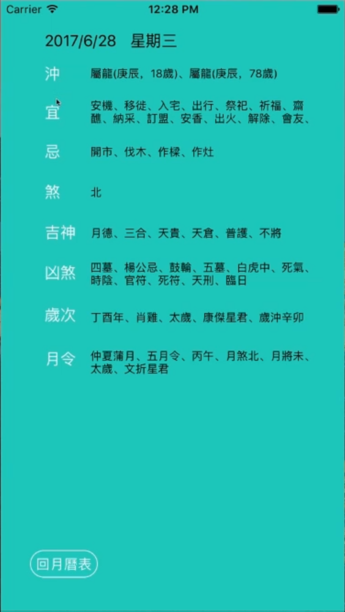
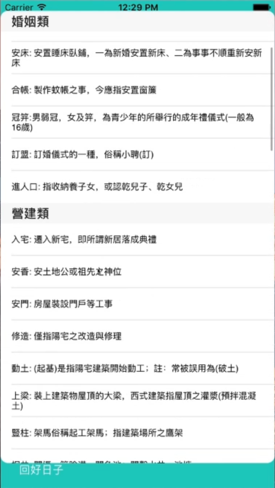

# Lunarrator
農民曆月曆記事

(點擊可觀看Demo影片)

**封面頁面**

- 點擊以進入程式
- 封面icon

**月曆頁面**

- 月曆
  - 點擊日子進入單日頁面

- 好日子按鈕
  - 點擊好日子按鈕進入好日子頁面

- 活動按鈕
  - 點擊活動按鈕進入瀏覽目前舉行中的活動頁面

**單日頁面**

- 單日記事

  - 紀錄單日事項

- 今日農民曆

  - 顯示今日農民曆的宜與忌

**好日子頁面**

<figure class="third">
    
    
    
</figure>

- 小知識按鈕

  - 點擊以了解農民曆相關知識

- 好日子篩選

  - 以時間區間篩選符合條件的好日子

  - 條件為標籤式 點擊選取 再點擊取消

**活動頁面**

<figure class="third">
    
    
    
</figure>

- Tab Bar 切換 目前活動（舉行中） / 最近活動 / 已結束活動（依時間排列）

- 建立活動（活動包含 活動名稱 活動期間 活動提醒）

